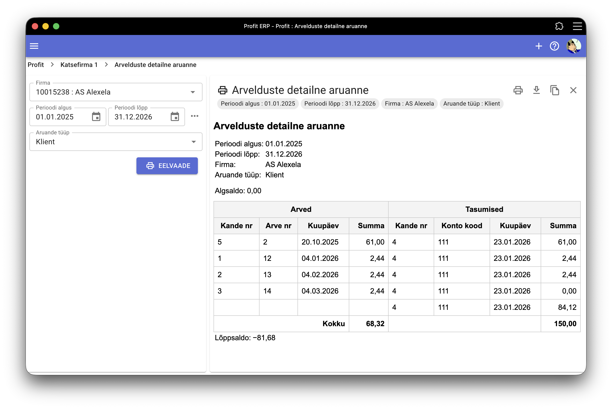

# Arvelduste detailne aruanne

Aruanne võimaldab näha perioodi jooksul kliendile või tarnijale esitatud arved ja nende tasumisi/laekumisi.

Aruanne on jagatud kahte ossa:

- Vasakus osas on koostatud või saadud arved
- Paremal pool arve järel laekumised/tasumised, mis selle arvega on seotud ning jääk.

Aruande alguses ja lõpus kuvatakse ka firma saldo valitud perioodi kohta.

Aruandes toimib *drill-down* funktsioon, mis võimaldab aruande real kande numbrile vajutades kandesse liikuda.

Aruannet on võimalik trükkida/salvestada PDF-i, salvestada või kopeerida HTML formaadis.
