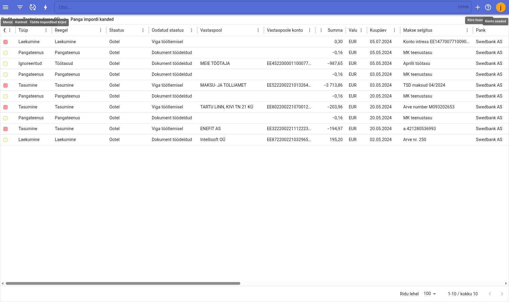
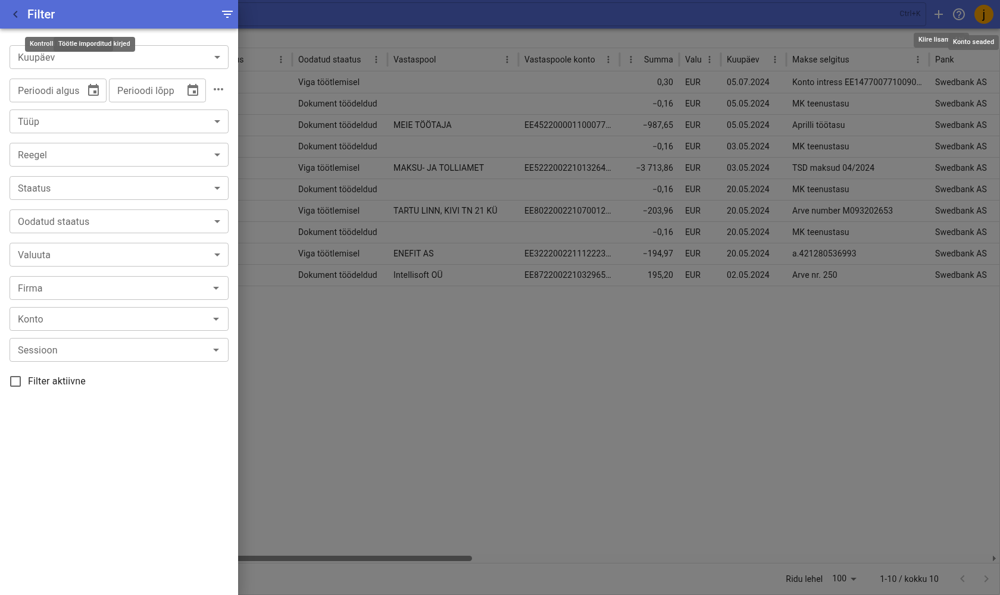
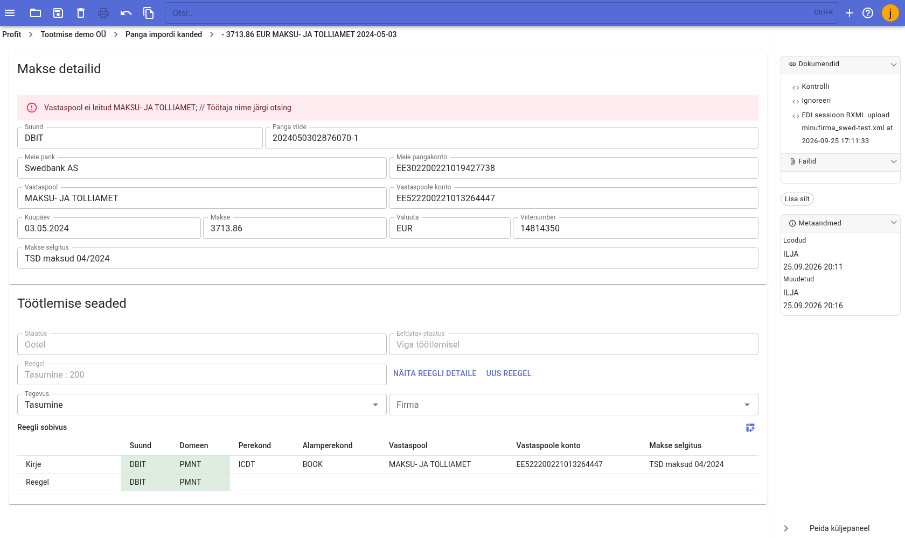

# Panga impordi kanded

Pangaväljavõtte importimisel salvestatakse iga pangast tulnud liikumine Profitis eraldi **kirjena**. Kirjeid hoitakse registris, mille leiad menüüst **Pank / Panga impordi kanded**. Registris saab kirjed üle vaadata ja kontrollida ning nende põhjal dokumente luua.

Iga kirje vastab ühele pangaväljavõtte tehingule (laekumine, tasumine, pangateenus, kaardimakse vms). Selle, millise dokumendi kirjest luuakse, otsustab [pangaimpordi reegel](rules.md).

## Väljavõtte import

1. Ekspordi pangast väljavõte **ISO XML** formaadis (053 või jooksva päeva liikumiste jaoks 052).
2. Ava menüü **Pank / Panga impordi kanded**.
3. Lohista eksporditud XML-fail kirjete registri aknasse. Programm loeb kirjed sisse ja kontrollib need automaatselt, kuid **dokumente import ise veel ei loo** — selleks tuleb kirjed eraldi töödelda.

!!! info "Korduv import"
    Juba imporditud kirjet uuesti ei lisata. Unikaalsust kontrollitakse **panga viite** järgi.

## Kirjete register

Registri tabelis kuvatakse iga kirje kohta:

|Veerg|Tähendus|
|-----|--------|
|Värv|Rea taustavärv (kollane, punane või roheline) — näitab kirje seisu|
|Tüüp|Millise dokumendi kirjest luuakse: Laekumine, Tasumine, Kanne, Pangateenus, Kaardimakse või Ignoreeritud|
|Reegel|Kirjele rakendunud [pangaimpordi reegel](rules.md)|
|Staatus|Kirje töötlemise seis (Ootel, Dokument töödeldud, Viga töötlemisel)|
|Oodatud staatus|Mida kontrolli tulemusel oodatakse (Dokument töödeldud või Viga töötlemisel)|
|Vastaspool|Vastaspoole nimi|
|Vastaspoole konto|Vastaspoole pangaarve (IBAN)|
|Summa|Tehingu summa|
|Valuuta|Tehingu valuuta|
|Kuupäev|Makse kuupäev|
|Makse selgitus|Maksekorralduse selgitus|
|Pank|Pank, kust väljavõte pärineb|
|Panga viide|Panga poolt antud tehingu viide|
|Teated|Impordi- ja kontrolliteated (nt miks kirje töötlemine ebaõnnestus)|

Tööriistaribal on:

- **Filter** — avab [kirjete filtreerimise](#kirjete-filtreerimine) paneeli.
- **Kontrolli imporditud kirjed** — kontrollib kõiki hetkel filtreeritud kirjeid ja täidab veeru „Teated".
- **Töötle imporditud kirjed** — töötleb kõik hetkel filtreeritud kirjed, st loob neist dokumendid (küsib kinnitust).

### Kirje summa märk

Liikumise suunda näitab märk summa ees: **negatiivne summa** on väljaminek (deebet) ja **positiivne summa** sissetulek (kreedit).

## Kirjete filtreerimine

Igapäevatöös tasub kirjeid filtreerida, et kuvada korraga ainult hetkel aktuaalsed kirjed. Filtri saad avada tööriistariba nupust **Filter**.

Filtri võimalused:

- **Perioodi algus / Perioodi lõpp** — piira kirjed kuupäevavahemikuga.
- **Tüüp** — millise dokumendi kirjest luuakse.
- **Reegel** — kirjele rakendunud reegel.
- **Staatus** — kirje töötlemise seis.
- **Oodatud staatus** — kontrolli oodatav tulemus.
- **Valuuta** — tehingu valuuta.
- **Firma** — vastaspool (firma).
- **Konto** — tasumise viisi konto.
- **Sessioon** — konkreetne impordisessioon (ühe faili import).
- **Filter aktiivne** — lülitab filtri sisse/välja.

!!! tip "Sessiooni filter"
    Kui impordid korraga suurema hulga kirjeid, on **Sessioon** filtriga mugav töötada ühe konkreetse impordiga — nii näed ja töötled ainult just selle faili kirjeid.

## Kirje kaart

Kirje kaardi avamiseks tee tabeli real **topeltklõps**.

Kaart jaguneb kaheks: **Makse detailid** ja **Töötlemise seaded**.

### Makse detailid

Pangast tulnud andmed, mida impordi käigus ei muudeta:

- **Suund** — `CRDT` (kreedit, raha tuleb sisse) või `DBIT` (deebet, raha läheb välja).
- **Panga viide** — tehingu unikaalne viide.
- **Meie pank** ja **Meie pangakonto** — väljavõtte pangaarve.
- **Vastaspool** ja **Vastaspoole konto** — teise poole nimi ja pangaarve.
- **Kuupäev**, **Makse**, **Valuuta**.
- **Viitenumber** ja **Makse selgitus**.

Kui kontroll leiab probleemi, kuvatakse kaardi ülaosas ka vastav hoiatus (nt „Vastaspool ei leitud").

### Töötlemise seaded

Siin otsustatakse, mida kirjest tehakse:

- **Staatus** ja **Eeldatav staatus** — ainult vaatamiseks. Eeldatav staatus näitab, mis saab kirjest kontrolli tulemusel.
- **Reegel** — ainult vaatamiseks; näitab, milline reegel kirjele rakendus. Nuppudega **Näita reegli detaile** ja **Uus reegel** saab reegli üle vaadata või luua kirje põhjal uue reegli.
- **Tegevus** — mida kirjest tehakse (nt Laekumine, Tasumine, Kanne, Pangateenus, Kaardimakse, Ignoreeritud). Vajadusel saad automaatselt valitud tegevust muuta.
- **Firma** — vastaspool.
- **Konto** — konto valik (kuvatakse, kui tegevus seda nõuab, nt Kanne või Pangateenus).
- **Teenustasu konto** — teenustasu konto (nt Kanne ja Kaardimakse puhul).

All olevas jaotises **Reegli sobivus** kõrvutatakse kirje tunnuseid (Kirje) reegli tingimustega (Reegel) — nii on kohe näha, miks üks või teine reegel rakendus.

## Kirjete kontrollimine ja töötlemine

1. **Kontroll** — imporditud kirjed kontrollitakse automaatselt. Vajadusel saab neid uuesti kontrollida nii üksiku kirje kaardilt (külgpaneel **Dokumendid** → **Kontrolli**) kui ka tööriistaribalt nupuga **Kontrolli imporditud kirjed** (kontrollib kõiki hetkel filtreeritud kirjeid).
2. **Töötlemine** — nupuga **Töötle imporditud kirjed** (või kirje kaardil **Töötle**) luuakse kirjetest dokumendid. Programm küsib enne kinnitust ja töötleb hetkel **filtreeritud** kirjed.
3. **Ignoreerimine** — kirje, mida dokumenti tegema ei pea, saab kirje kaardil märkida nupuga **Ignoreeri**.
4. **Töötlemise tühistamine** — juba töödeldud kirje külgpaneelis on nupp **Kustuta loodud dokumendid**, mis eemaldab kirjest loodud dokumendid.

## Staatuseid ja värvid

|Staatus|Värv|Tähendus|
|-------|----|--------|
|**Ootel**|kollane|Kirje on imporditud, kuid dokumente pole veel loodud. Eeldatav staatus „Viga töötlemisel" korral on rida **punane**|
|**Dokument töödeldud**|roheline|Kirjest on dokument loodud|
|**Viga töötlemisel**|punane|Kirje kontroll või töötlemine ebaõnnestus — põhjus on veerus **Teated** või kirje kaardi hoiatuses|

## Seotud seadistused

Pangaimpordi üldised seadistused (nt puuduolevate firmade otsimine äriregistrist, laekumiste ja tasumiste automaatne sidumine ning kinnitamine) leiad menüüst **Seadistused → Pangaväljavõtte import**. Need mõjutavad seda, kuidas kirjeid automaatselt seotakse ja kinnitatakse.

Dokumendi liigi, mille reegel kirjest loob, määrab [pangaimpordi reegel](rules.md).

!!! info
    Moodul on aktiivses arenduses ja sinna lisanduvad pidevalt uued võimalused ja funktsioonid. Kui juhendist ei leia vastust, võtke ühendust aadressil [info@intellisoft.ee](mailto:info@intellisoft.ee) – võimalik, et funktsioon on juba olemas.
