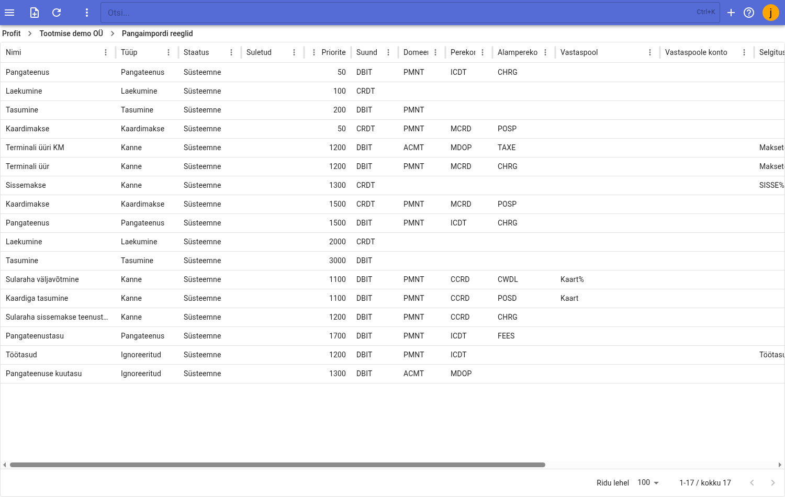
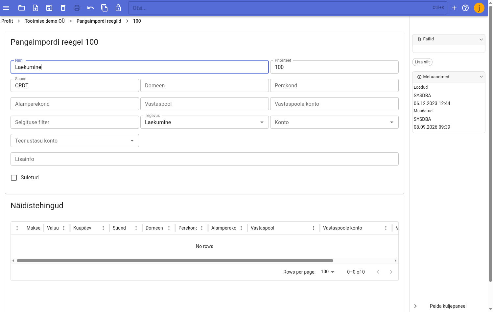
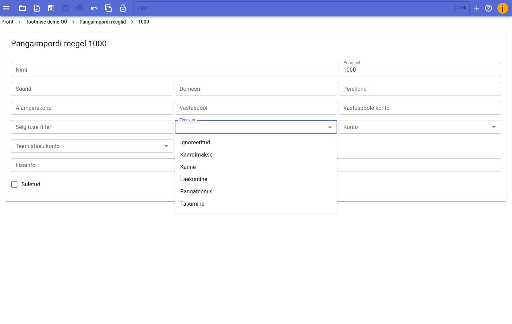

# Pangaväljavõtte reeglid

Pangaväljavõtte reeglid määravad, millised dokumendid imporditud väljavõtte kirjetest luuakse. Iga väljavõttelt tulev kirje (laekumine, tasumine, teenustasu, kaardimakse vms) sobitatakse reeglitega ja kõige paremini sobiva reegli alusel otsustatakse, mida kirjest teha.

Reeglite register asub menüüs **Pank / Pangaimpordi reeglid**.

Programmiga tulevad kaasa *süsteemsed* reeglid, mis katavad lihtsamad ja levinumad vajadused. Kasutaja saab lisada endale vajalikke reegleid või muuta olemasolevaid.

## Reeglite register

Registri tabelis kuvatakse iga reegli kohta:

|Veerg|Tähendus|
|-----|--------|
|Nimi|Reegli nimetus|
|Tüüp|Millist dokumenti reegel loob (nt Laekumine, Tasumine, Kanne, Pangateenus, Kaardimakse)|
|Staatus|Kas reegel on **Süsteemne** (Profitiga kaasas) või kasutaja loodud|
|Suletud|Kas reegel on kasutusest väljas|
|Prioriteet|Reegli rakendumise järjekord (väiksem number = kõrgem prioriteet)|
|Suund|Kirje suund ISO-koodina (`CRDT` / `DBIT`)|
|Domeen|Väljavõtte kirje domeen ISO-koodina (nt `PMNT`, `ACMT`, `CCRD`)|
|Perekond|Väljavõtte kirje perekond ISO-koodina (nt `ICDT`, `MCRD`)|
|Alamperekond|Väljavõtte kirje alamperekond ISO-koodina (nt `CHRG`, `POSP`, `CWDL`)|
|Vastaspool|Vastaspoole nime filter|
|Vastaspoole konto|Vastaspoole pangaarve (IBAN) filter|
|Selgituse filter|Maksekorralduse selgituse filter|
|Looja / Loodud|Reegli looja ja loomise aeg|

Kirje avamiseks tee tabeli real **topeltklõps** – avaneb reegli kaart.

## Reegli väljad

Reegli funktsionaalsus jaguneb kaheks: **kirjete filtreerimine** (millistele väljavõtte kirjetele reegel rakendub) ja **dokumentide loomine** (mida nendest kirjetest tehakse).

### Kirjete filtreerimine

- **Suund** – kirje suund ISO 20022 väljavõttefailist: `CRDT` (kreedit – raha tuleb sisse) või `DBIT` (deebet – raha läheb välja).
- **Domeen** – kirje domeen ISO-koodina, nt `PMNT` (maksed), `ACMT` (kontohaldus), `CCRD` (kaarditoimingud).
- **Perekond** – kirje perekond ISO-koodina, nt `ICDT` (kreeditülekanne), `MCRD` (kaardimakse).
- **Alamperekond** – kirje alamperekond ISO-koodina, nt `CHRG` (teenustasu), `POSP` (müügikoha makse), `CWDL` (sularaha väljavõtmine).
- **Vastaspool** – vastaspoole nime filter. Toetab osalist otsimist `%` sümboli abil (nt `%Swedbank%`).
- **Vastaspoole konto** – vastaspoole pangaarve (IBAN) filter, samuti osaline otsing `%` abil.
- **Selgituse filter** – maksekorralduse selgituse filter, osaline otsing `%` abil.
- **Suletud** – kui linnuke on sees, reeglit ei kasutata.

!!! tip "Prioriteet"
    Ühele kirjele rakendub **ainult üks** reegel – kõrgeima prioriteediga (väikseima prioriteedi numbriga) sobiv reegel. Seetõttu tasub spetsiifilisemate filtritega reeglitele määrata **kõrgem prioriteet** (väiksem number) kui üldistele reeglitele.

### Dokumentide loomine

- **Tegevus** – mida antud kirjest tehakse. Võimalikud valikud:
    - **Pangateenus** – luuakse kanne (valitud konto alusel). Sama päeva teenustasud liidetakse kokku.
    - **Laekumine** – luuakse laekumine.
    - **Tasumine** – luuakse tasumine.
    - **Kanne** – luuakse kanne (kasutatakse valitud kontot).
    - **Ignoreeritud** – kirje jäetakse vahele ja märgitakse töödelduks.
    - **Kaardimakse** – luuakse kanne (kasutatakse kontot ja teenustasu kontot).
- **Konto** – konto valik, kui luuakse kanne (Pangateenus, Kanne, Kaardimakse). Teisele poole tuleb pangakontole vastava tasumise viisi konto.
- **Teenustasu konto** – teenustasu konto valik (nt kaardimakse puhul, kui pank selle info edastab).
- **Lisainfo** – vaba tekst reegli täpsustamiseks.

### Mittefunktsionaalsed väljad

- **Nimi** – reeglil peab olema nimetus.
- **Näidistehingud** – reegli kaardil (all) kuvatakse väljavõtte kirjed, mis antud reegliga sobivad. Nimekirja uuendatakse salvestamise järel, seega saab kohe kontrollida, millistele kirjetele reegel rakendub.

## Uue reegli lisamine

1. Ava menüü **Pank / Pangaimpordi reeglid**.
2. Vajuta tööriistariba **Uus** nupule – avaneb reegli kaart.
3. Täida filtrite väljad (Suund, Domeen, Perekond, Alamperekond, Vastaspool, Vastaspoole konto, Selgituse filter) ja määra **Prioriteet**.
4. Vali **Tegevus** ja vajadusel **Konto** / **Teenustasu konto**.
5. Salvesta reegel tööriistaribalt.

Tegevuse valikud on: *Ignoreeritud, Kaardimakse, Kanne, Laekumine, Pangateenus, Tasumine*.

!!! info
    Moodul on aktiivses arenduses ja sinna lisanduvad pidevalt uued võimalused ja funktsioonid. Kui juhendist ei leia vastust, võtke ühendust aadressil [info@intellisoft.ee](mailto:info@intellisoft.ee) – võimalik, et funktsioon on juba olemas.
