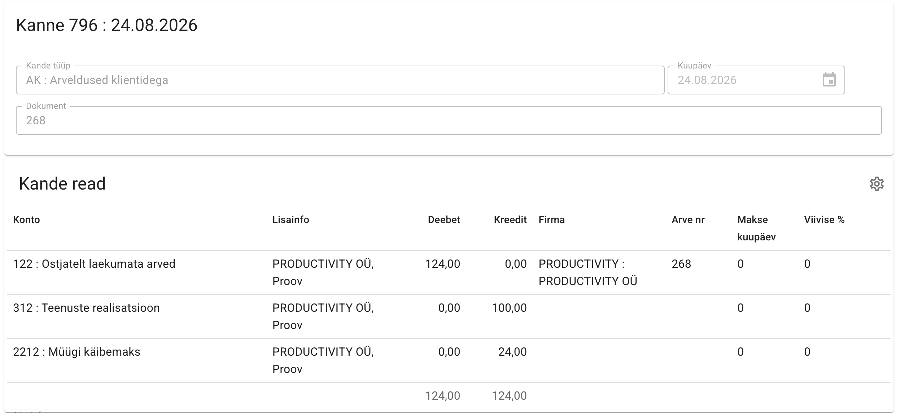
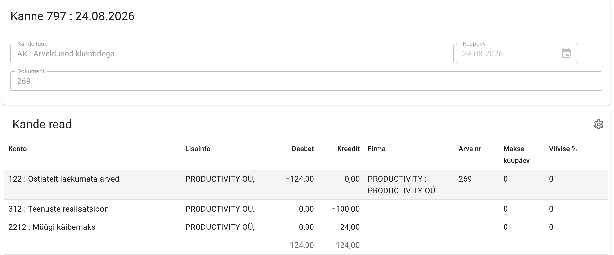
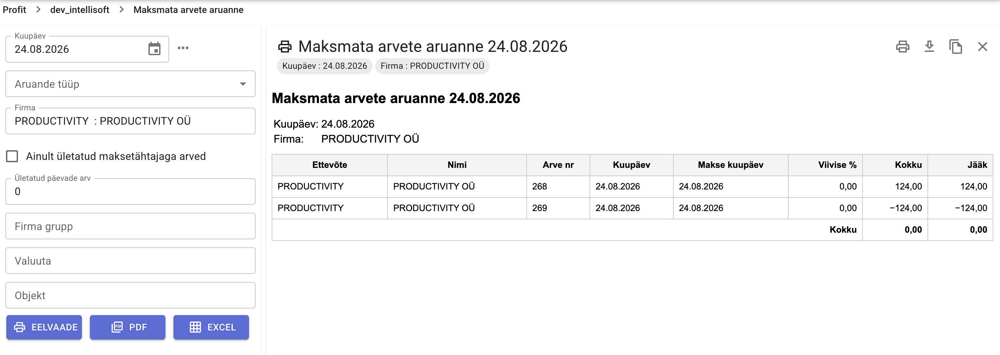
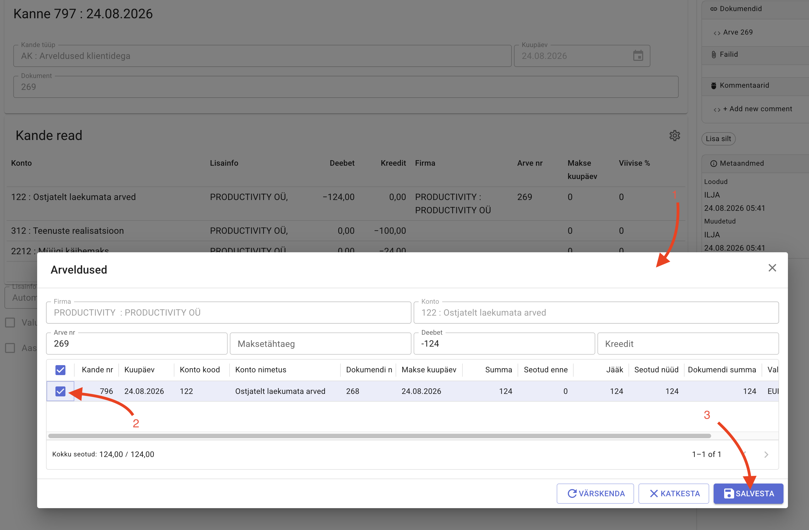

# Set-offs

Set-off allows you to link an invoice and a credit note, or a purchase invoice and a sales invoice. The linked obligations do not have to be for the same amount, and several obligations can be set off at once.

## A simple example

For example, we have an invoice and a credit note, both for the same amount (one positive, one negative).

Invoice

Credit note

After confirming, the unpaid invoices report shows both rows:

1. Open the settlements window.
2. Add the settlements:
    - from the entry: click the menu button on the row and select **Settlements**
    - from the invoice card: relations on the right side
3. Link the documents and save.

After saving the set-off, both rows — the invoice and the credit note — disappear from the unpaid invoices report.
