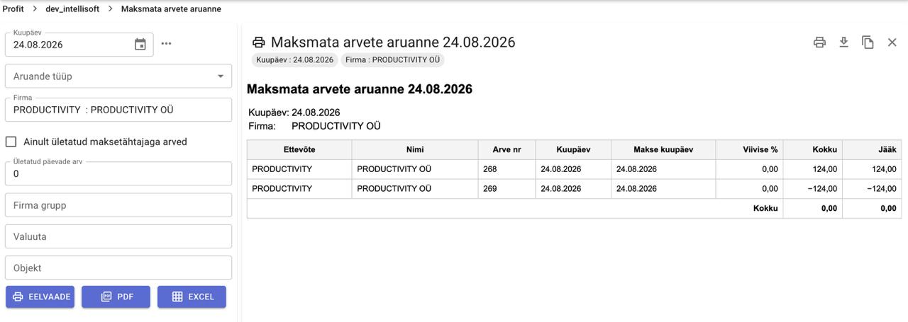

# Tasaarveldused

Tasaarveldamine võimaldab omavahel siduda arve ja kreeditarve või ostu ja müügiarve. Seotavad kohustused ei pea olema samas summas ja saab korraga tasaarveldada ka mitu kohustust.

## Lihtne näidis

Näiteks meil on olemas arve ja kreeditarve, mõlemad samas summas (üks plussiga, teine miinusega).

Pärast kinnitamist näitab maksmata arvete aruanne mõlemat rida:

1. Ava arvelduste aken.
2. Lisa arveldused:
    - kandest: vastaval real klõpsa menüü nupul ja vali **Arveldused**
    - arve kaardilt: paremal pool seosed
3. Seo dokumendid omavahel ja salvesta.

## Tulemus

Pärast tasaarvelduse salvestamist kaovad maksmata arvete aruandest mõlemad read — nii arve kui ka kreeditarve.
