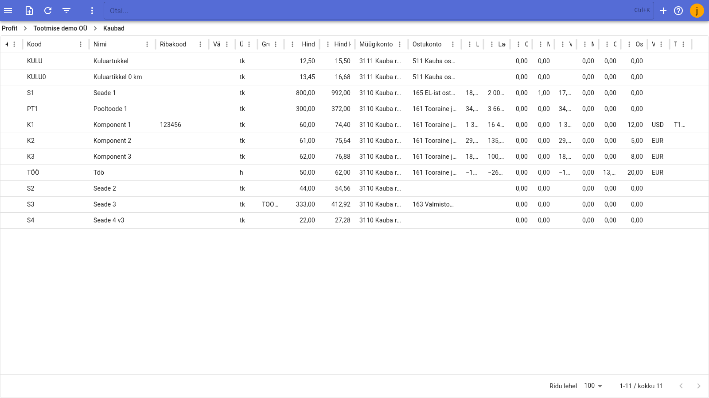
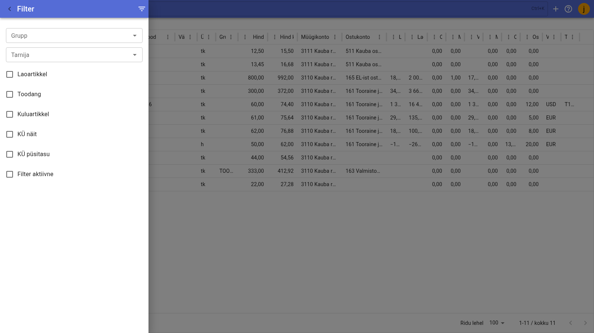
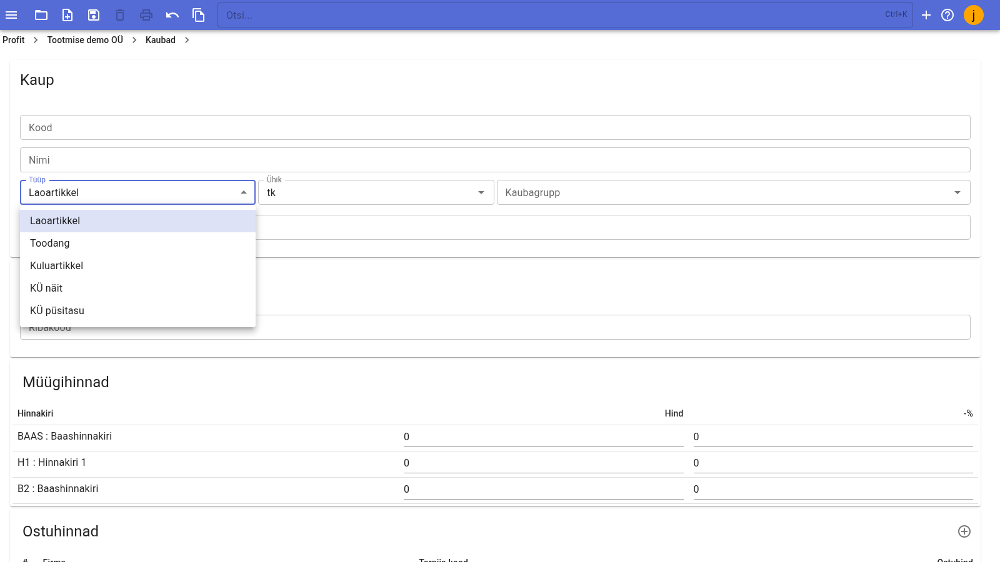
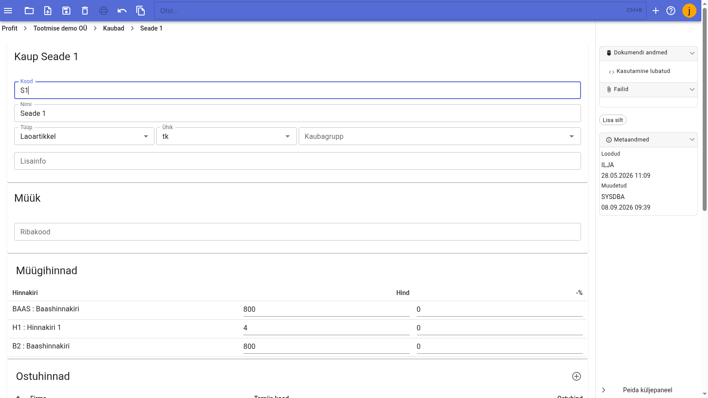

# Products

The Products registry contains all goods and services that the company sells or purchases – stock items, expense items, finished goods and services. The product card collects prices, components, financial accounts and other necessary information.

You can find the registry in the menu under **Sales → Products** (the same registry is also under **Purchases → Products**).

## Products registry

The registry table shows the following for each product:

|Column|Meaning|
|------|-------|
|Status|Product status icon (open/closed)|
|Code|Product code|
|Name|Product name|
|Barcode|Product barcode|
|Colour|Product colour|
|Unit|Unit of measure|
|Group|Product group|
|Price|Sales price|
|Price incl. VAT|Sales price including VAT|
|Sales account|Sales account|
|Purchase account|Purchase account|

- To sort rows, click a column header.
- Each column header has a menu for configuring columns (show/hide, reorder).
- At the bottom of the table you can choose how many rows are shown per page.
- To search, use the field on the top bar **Otsi…** (shortcut ++ctrl+k++).

## Filtering

The filter button on the toolbar opens the filter panel:

- **Group** – show only products of the selected product group;
- **Supplier** – show only products of the selected supplier;
- **Type** – **Stock item**, **Production**, **Expense item**, **KÜ indicator**, **KÜ fixed fee**.

To apply the filter, tick **Filter active**; when you untick it, all products are shown again.

## Adding a new product

1. Open **Sales → Products** from the menu.
2. Click the **New** button on the toolbar – an empty product card opens.
3. Fill in the main fields (Code, Name, Type, Unit, Product group, Additional info).
4. Save the card from the toolbar.

Main fields:

- **Code** – product code (a combination of letters and/or digits);
- **Name** – product name;
- **Type** – **Stock item**, **Production**, **Expense item**, **KÜ indicator** or **KÜ fixed fee**;
- **Unit** – unit of measure, selected from the units registry;
- **Product group** – product group (optional);
- **Additional info** – free text about the product.

## Product card

The product card is divided into sections:

- **Sales** – barcode;
- **Sales prices** – the product's sales prices by price list;
- **Purchase prices** – suppliers' purchase prices;
- **Finance** – sales and purchase accounts and VAT rates;
- **Components** – components (recipe) of a finished or semi-finished product;
- **History** – history of changes to product data (opens on click).

The right-hand side panel contains:

- **Document data** – product status (e.g. **Usage allowed** – the product can be used on documents);
- **Files** – files attached to the product;
- **Add label** – adding labels;
- **Metadata** – who created and changed the product, and when.

### Sales prices

The **Sales prices** section contains a table with the columns **Price list**, **Price** and **-%**. For each price list row you can enter the product's sales price and discount percentage. Price lists are managed in **Sales → Price lists**.

### Purchase prices

In the **Purchase prices** section you can enter a supplier's purchase price for the product. The table columns are **#**, **Company** (supplier), **Supplier code** and **Purchase price**. To add a new row, click the **+** button of the section. You can enter several purchase prices, for example when the product is bought from different suppliers at different prices.

### Finance

- **Account** – sales account (e.g. 3110 Sales of goods);
- **VAT%** – sales VAT rate;
- **Purchase account** – purchase account (e.g. 165 Goods purchased from the EU);
- **Purchase VAT rate** – purchase VAT rate.

### Components

In the **Components** section you define the recipe of a finished (or semi-finished) product – the components and their quantities. The table columns are **#**, **Component**, **Quantity** and **Warehouse**. To add a new component, click the **+** button of the section. A component can also be an expense item.

### History

**History** opens on click and shows who changed the product data and when.

!!! info
    The module is under active development and new features are being added continuously. If you cannot find an answer in the guide, contact us at [info@intellisoft.ee](mailto:info@intellisoft.ee).
