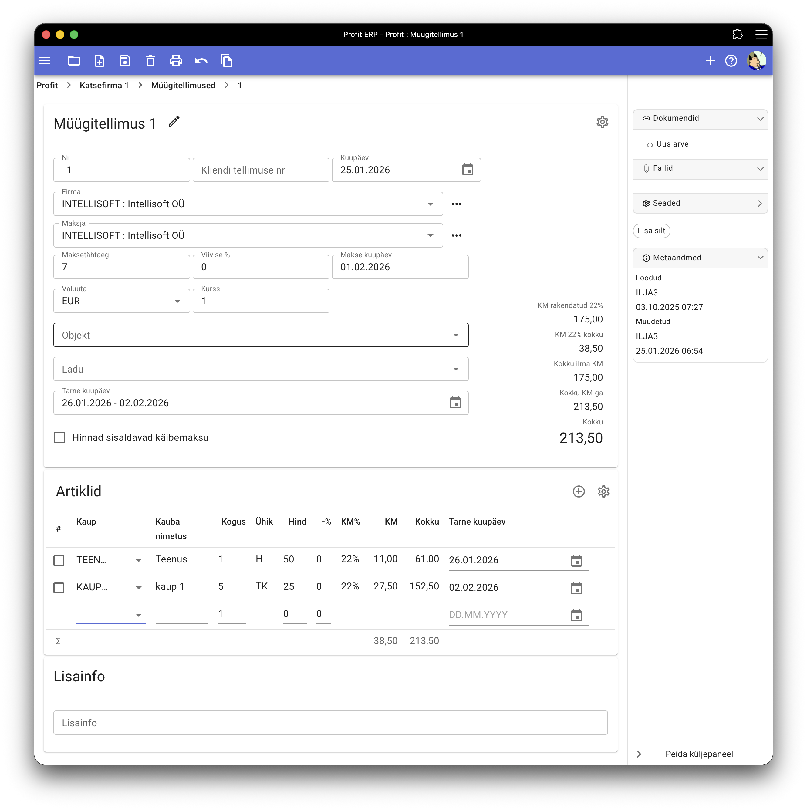

# Müügitellimused

## Tellimuse kaart

Müügitellimuse kaardil saab sisestada järgmised andmed:

- Tellimuse number - tuleb automaatselt, saab muuta
- Kliendi tellimuse number
- Kuupäev
- Firma - tellija
- Maksja
- Maksetähtaeg - tuleb automaatselt firma andmetest, saab muuta. Programm automaatselt arvutab ja kuvab makse kuupäeva
- Viivise protsent - tuleb automaatselt firma andmetest, saab muuta
- Valuuta, kurss
- Objekt
- Ladu
- [Erinevad lisaandmed](#tellimuse-lisaandmed)
  - Artiklid - artiklite tabel, igal real järgmised andmed
    - Kaup - valik kaubatabelist
    - Kauba nimetus - juhul, kui soovitakse väljatrükile kauba kaardilt erinevat nimetust
    - Kogus
    - Hind - tuleb automaatselt kliendiga seotud hinnakirjast
    - Allahindlusprotsent
    - Käibemaksu määr - tuleb automaatselt vastavalt kliendile ja kaubale, saab muuta
    - [Erinevad lisaandmed](#tellimuse-lisaandmed)
- Tellimuse lisainfo

### Seosed

Paremal pool (mobiilis allpool) asub [lisaandmete paneel](../ui/doc_sidepanel.md)

#### Müügiarve moodustamine

Tellimusest saab genereerida müügiarveid. Selleks tuleb kasutada linki "Uus arve" küljepaneeli dokumentide alajaotuses.
Programm loob ja avab uut müügiarvet.

Ühest tellimusest saab luua mitu müügiarvet.
Küljepaneelil kuvatakse tellimusega seotud arved.

### Tellimuse lisaandmed

#### Tarneinfo

Igale reale saab sisestada tarne kuupäeva.

Tellimuse päises kuvatakse tellimuse tarneperioodi - vahemiku ridade varasemast tarnekuupäevast hiliseimani tarnekuupäevani.

Kõigi tellimuste tarneaegade muutmiseks tuleb klõpsata kalendri nuppu päises tarne kuupäeva lahtri paremas osas ja valida uus kuupäev.

!!!info "Tarneinfo kuvamine"

    Tarneinfo sisselülitamiseks klõpsake seadistuste nuppu müügitellimuse päises ja lülitage sisse "Tarne kuupäev".
    
    Kui tarneinfo kuvamine ei ole teie ettevõtte jaoks oluline, saate selle välja lülitada.

## Tellimuste register
