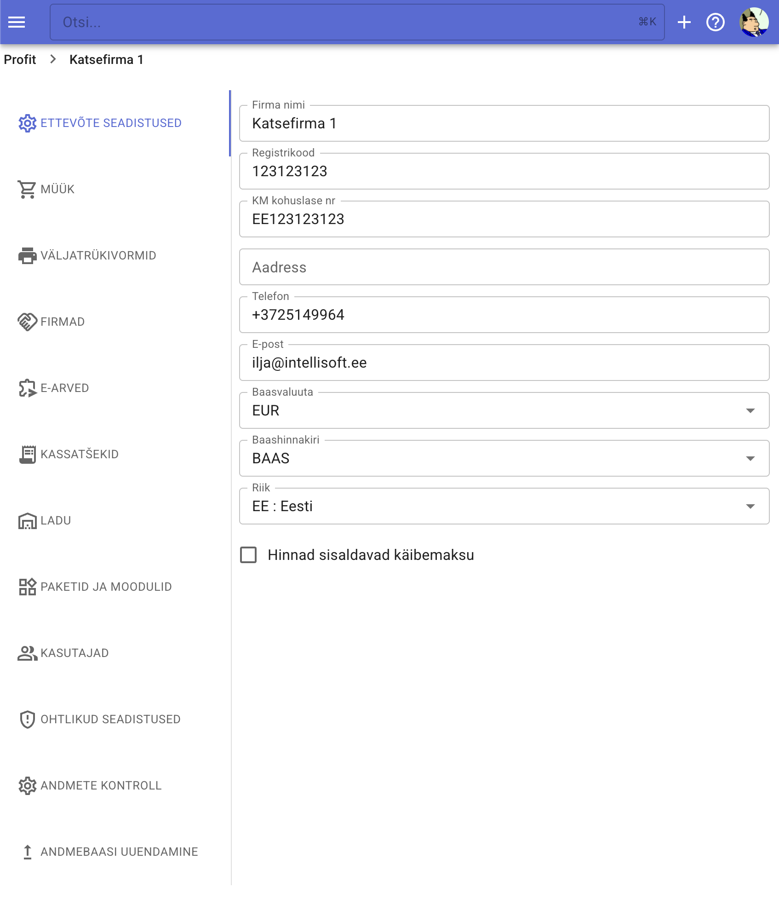

# Esmased firma seadistused

Peale ettevõtte andmebaasi loomist tuleks üle vaadata selle põhilised seadistused.

Seadistustesse saab firma esilehelt, kui klõpsata firma nimest paremal pool olevat hammasratta ikooniga nuppu.

Samuti saab programmi menüüst. Alumises osas on valik **Seaded**.

Firmade nimekiras iga firma rea paremal pool on samuti seadistuste nupp.

Seaded on jagatud järgmisteks alajaotisteks:

## Ettevõtte seadistused.

Saab määrata firma põhilisi rekvisiite:

- nimi
- registrikood
- km kohuslase number
- aadress
- telefon
- e-mail
- baasvaluuta
- baashinnakiri
- riik
- kas sisestatakse käibemaksuga hindu

Väljade sisu salvestub väljast lahkumisel

## Müük

Müügiga seotud seadistused:

- Müügiarve ümardamise reeglid

## Väljatrükivormid

Siin saab seadistada müügiarve, tellimuse ja pakkumise väljatrükki:

- logo valik ja seadistused
- kliendi andmete trükkimise sätted
- kaubaridade trükkimise seaded
- lisatekstide trükkimine ja vaikimisi väärtused
- arve jaluse info
- jm

## Firmad

Firmade registri vaikimisi väärtused

- maksetähtaeg
- kliendi ja tarnija konto

## E-arve

Erinevad e-arve saatmisega ja vastuvõtmisega seotud seadistused

## Kassatšekid

Saab seadistada kassatsekkide ja ostuarvete äratundmise funktsiooni

- Funktsiooni sisselülitamine
- Ridade info tuvastamine
- **Järjekorra kasutus** - kui lülitada see sisse, imporditud tsekid paigutatakse järjekorda kust AI assistent hakkab neid tuvastama. Sellisel juhul ei pea ootama arvete üleslaadimist.
- Silt imporditud ostuarvele - imporditud ostuarved saab eristada sildi abil
- Vaikimisi kaup - kui arve ridu võetakse kokku üheks reaks, kasutatakse seda kaupa. Samuti kauba saab seadistada tarnijapõhiselt.

## Ladu

Saab määrata saatelehtede loomise automaatika

## Paketid ja moodulid

Millist paketti kasutab antud firma.

## Kasutajad

Ettevõtte haldur saab lisada ja eemaldada kasutajaid.

Kasutaja lisamiseks peab teadma kasutajanime (vt [kasutajanime valik](register/#kasutajanime-valik)) või meiliaadressi.

Samuti meiliaadressi abil saab kutsuda Profitisse kedagi, kellel veel pole Profiti kontot. Sellisel juhul talle saadetakse kutse meilile.

## Ohtlikud seadistused

Andmebaasi kustutamine ja andmebaasi omandi üleandmine.

Kustutatud andmebaasi saab mõne päeva jooksul taastada, selleks tuleb võtma ühendust meie konsultandiga. Peale selle perioodi lõppemist andmebaasi kustutatakse täielikult. Andmebaasi taastamine on tasuline tegevus.

Andmebaasi omandi üleandmise järel endine omanik ei saa hallata kasutajaid, kustutada andmebaasi. Andmebaasi omandi üleandmine on pöördumatu protseduur ja selleks, et andmebaasi pärast seda tagasi saada, tuleb kokku leppida uue haldajaga.

## Andmete kontroll

Saab seadistada, millised automaatsed andmete kontrollid toimivad.

## Andmebaasi uuendamine

Vajadusel saab andmebaasi haldur teha andmebaasi struktuuri kontrolli ja paranduse. Reeglina seda teha ei ole vaja. Programm automaatselt parandab andmebaasi struktuuri kord päevas.
