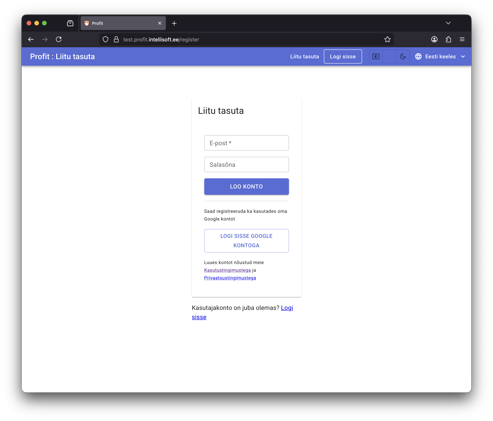
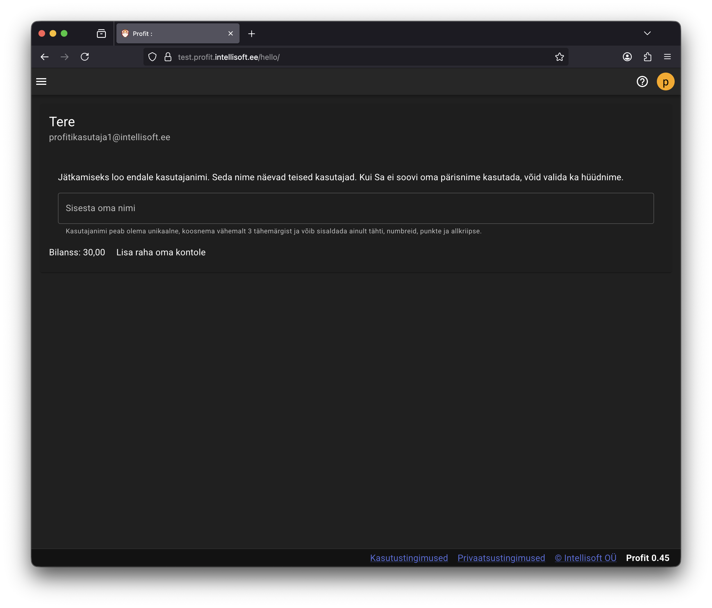

# Kasutaja registreerimine

Registreerimiseks minge aadressile [https://app.profit24.eu/](https://app.profit24.eu/) ja valige ["Liitu Profitiga tasuta"](https://app.profit24.eu/register)

!!!note "&nbsp;"
    Kasutaja registreerimine on tasuta!

Profitiga saate liituda kasutades oma meiliaadressi ja valides salasõna või Google kontoga. Tulevikus lisanduvad ka muud autentimise võimalused.

## Kasutaja registreerimine meiliaadressi ja salasõnaga

Täitke väljad **E-post** ja **Salasõna** ning vajutage **Loo konto**. Saategi kohe programmi sisse.

!!!danger "NB!"
    - Jälgige, et salasõna ei oleks kergesti äraarvatav!
    - Ärge kasutage sama salasõna mitmes keskkonnas!
    - Kontrollige, et kasutate reaalset meiliaadressi, sinna saadame olulise info ja seda läheb vaja, kui näiteks salasõna unustate.
    - Profit ei edasta teie meiliaadressi teistele.

Siin on lühike video sellest, kuidas saab kasutaja registreerida:

    <iframe
        src="https://youtube.com/embed/VBa6Ir6EdbQ"
        frameborder="0"
        allow="accelerometer; autoplay; clipboard-write; encrypted-media; gyroscope; picture-in-picture"
        allowfullscreen
        style="position:absolute; top:0; left:0; width:100%; height:100%;">
    </iframe>

## Kasutaja registreerimine Google konto abil

Vajutage nuppu **Logi sisse Google kontoga**. Avaneb Google sisselogimise või Profiti äpile õiguste andmise aken. Kui saate Google autentimisega ja autoriseerimisega ühele poole, saate Profitisse sisse.

## Kasutajanime valik

Esimesel sisselogimisel programm palub teil valida enda kasutajanimi.

Kasutajanime kaudu näevad teid teised kasutajad. Nad saavad selle abil kutsuda teid oma ettevõtte andmebaasi.

Sisestage oma nimi või hüüdnimi ja vajutage **Enter**. Programm kontrollib nime sobivust ja unikaalsust ja kui sellega on kõik korras, avaneb firmade nimekiri.

