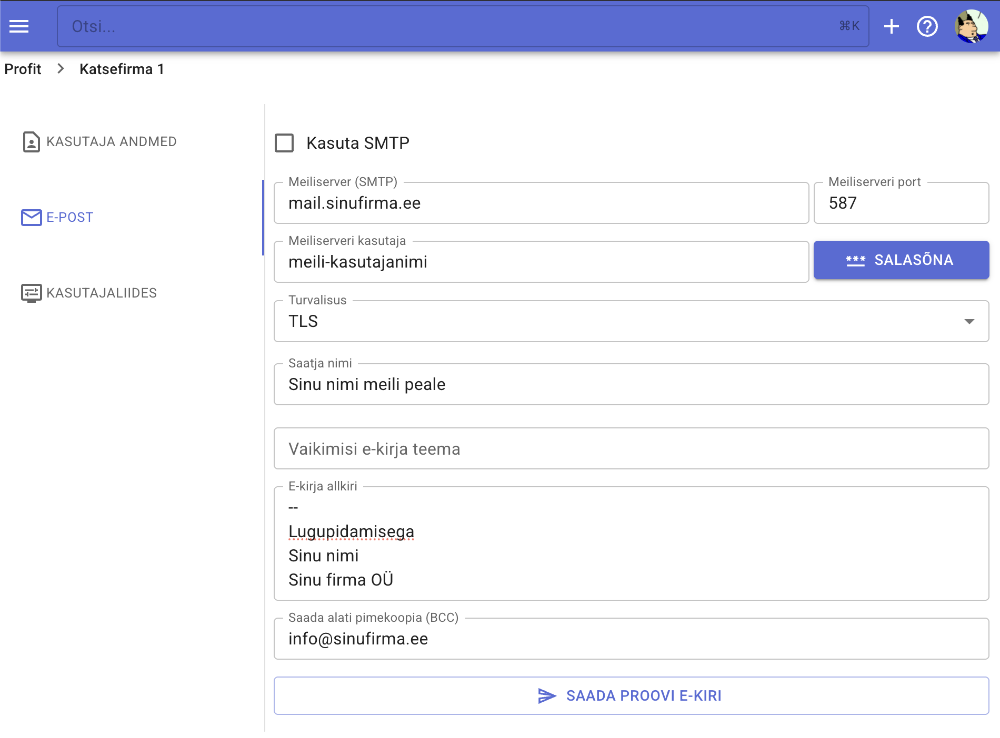

# Meili seadistamine

Selleks, et saata meilid (näitaks Profiti abil saab saada meiliga arved) pead seadistama meilikonto andmed.

- Sisene enda firmasse, näiteks firma esilehele ja ülemises paremas nurgas klõpsa enda kasutaja initsiaalidele või ikoonile.
- Avanenud rippmenüüst vali **Seaded**
- Vali alajaotus "E-post"
- Täida järgmised seadistused
    - Kasuta SMTP - linnuke sisse
    - Meiliserver (SMTP) - sisesta oma meiliserveri aadress
    - Meiliserveri port - sisesta pordi number, nt 587
    - Meiliserveri kasutaja - 
    - Salasõna sisestamiseks klõpsa vastavat nuppu ja uues aknas sisesta salasõna
    - Turvalisus, näiteks **TLS**
    - Saatja nimi - sisesta nime, mida meili saaja näeb saatja infos
    - Vaikimisi e-kirja teema
    - E-kirja allkiri - see tekst (saab sisestada mitu rida, nt ++Shift+Enter++-ga) lisatakse iga sinu meili lõppu
    - Saada alati pimekoopia (BCC) - võib sisestada siia näiteks enda firma üldine meiliaadress, Profit paneb selle aadressi meili pimekoopia lahtrisse, nii kõik saadetud kirjad dubleeritakse ja säilitatakse ka teie meiliserveris, meili saaja seda ei näe.
- Kui meili seadistused on tehtud, saad proovida saata proovikirja, et katsetada, kas kõik sai õigesti sisestatud ja meilimine toimib.

Nüüd saab saata arved meiliga.

!!!tip "Nipp"
    Proovi esimest arvega meili saata alguses endale ja vaata seda kriitiliselt üle, et veenduda, et kõik on nii, nagu peab olema.

