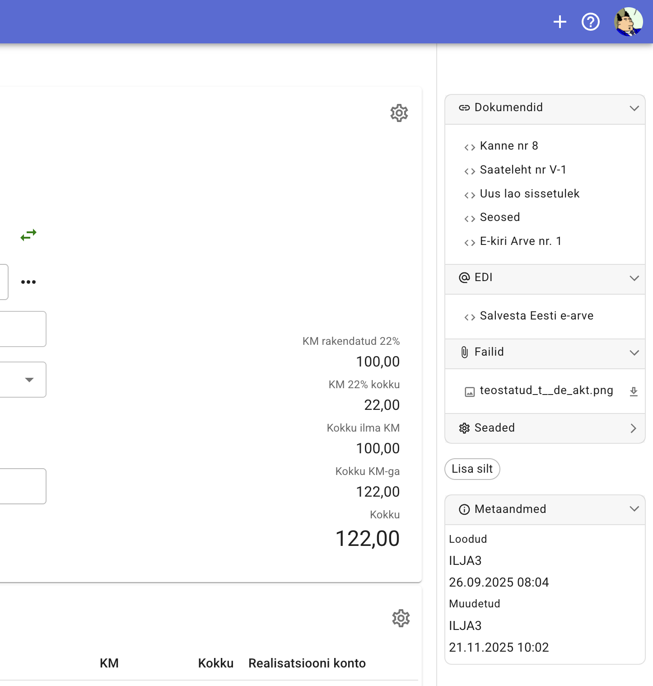

# Külgpaneel

Dokumendi paremal pool asub paneel, kust saab käivitada täiendavad tegevused dokumentidega, näha dokumendi manuseid, seotud dokumente ning dokumendi metaandmeid.

Paneel jaotatud osadeks, tüüpilised osad on järgmised:

## Dokumendid

Seosed teiste dokumentidega, näiteks arve võib olla seotud müügitellimusega, millest antud arve on moodustatud, lao väljamineku saatelehega jne.

Kui dokumendist saab moodustata teisi dokumente, näiteks müügitellimusest arvet, lao väljamineku saatelehte, tootmist jne

## Failid

Manused. Igasugused dokumendile lisatavad failid. Manuseid säilitatakse andmebaasis. Klõpsates manusele seda saab kuvada dokumendi kõrval või alla laadida. 

Manuse lisamiseks tuleb lihtsalt lohistada faili lisaandmete paneelile.

Kuvatakse levinud pildiformaate, PDF dokumente, tekstifaile.

Sõltuvalt ekraani suurusest manust kuvatakse dokumendi sisust paremal või allpool. See võimaldab suuremal ekraanil kõrvutada näiteks ostuarvet selle algdokumendiga selleks, et oleks mugavam neid võrrelda.

## Kirje sulgemine

Teatud püsiandmeid (näiteks firmad, kaubad) saab sulgeda siis, kui neid ei ole enam vaja kasutada.
Külgpaneeli alajaotuses *Dokumendi andmed* kuvatakse valikut "Kasutamine lubatud" või "Suletud".

- **Kasutamine lubatud** (vaikimisi väärtus) näitab seda, et kirjet saab kasutada ja see ei ole suletud.
- **Suletud** näitab seda, et kirje on suletud ja seda ei saa uutes dokumentides kasutada.
- Kui klõpsata valikul "Kasutamine lubatud", siis kirje suletakse
- Kui klõpsata valikul "Suletud", kirje avatakse kasutamiseks

<!-- TODO manuse kuvamisest rohkem -->

## Sildid

Lisaandmete paneelil kuvatakse dokumendi silte. Siit saab silte lisada ja eemaldada.

## Metaandmed

Dokumendi loomise ja viimase muudatuse andmed (kuupäev, kellaaeg, kasutaja)